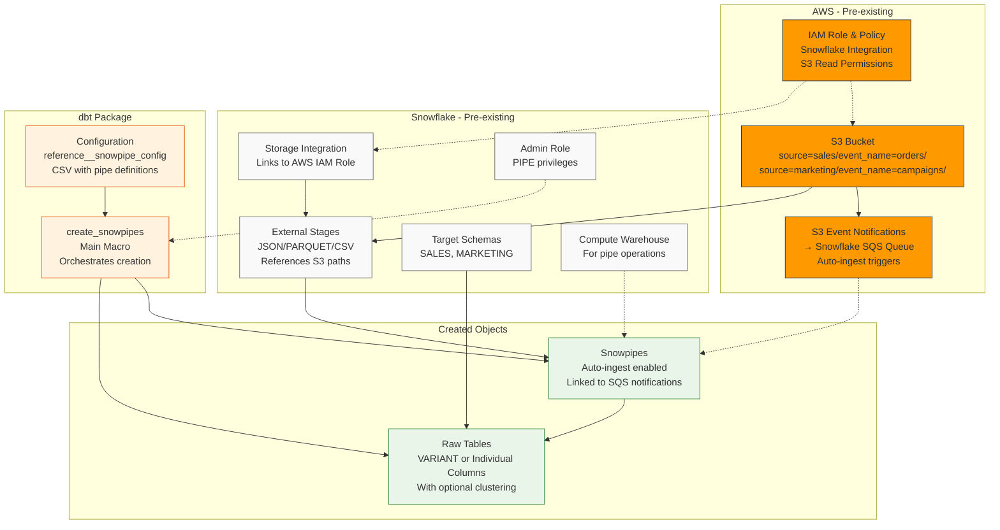

# dbt-snowpipe-utils

Automated Snowflake Snowpipe management with schema inference and evolution support.

## Architecture



## Overview

This dbt package automates the creation and management of Snowflake Snowpipes with support for:
- **Schema Inference**: Automatically detect column types from source files
- **Schema Evolution**: Automatically add new columns as data evolves
- **Multiple Storage Modes**: VARIANT or individual typed columns
- **Change Detection**: Safe updates without data loss
- **Environment Management**: Dev/staging/production configurations

## Prerequisites

This package creates Snowpipes and tables but requires existing Snowflake infrastructure:

### Required Objects (Must Exist)
- **Database & Schemas**: Target database with source schemas (e.g., `RAW_DB.SALES`)
- **External Stages**: Configured with storage integration and file formats
- **Warehouse & Roles**: Compute warehouse and admin role with PIPE privileges
- **Storage Integration**: For cloud storage access (S3/Azure/GCS)

### Data Structure Requirements
Files must follow this partitioning structure:
```
bucket/
├── source=sales/event_name=orders/event_type=daily/file1.parquet
├── source=sales/event_name=customers/file1.json
└── source=marketing/event_name=campaigns/file1.csv
```

**Path Mapping:**
- `source=sales` → Uses existing schema `RAW_DB.SALES`
- `event_name=orders` + `event_type=daily` → Creates table `ORDERS_DAILY`
- File extensions must match configured patterns (`.json`, `.parquet`, `.csv`)

## Quick Start

### 1. Install
```yaml
# packages.yml
packages:
  - git: "https://github.com/entechlog/dbt-snowpipe-utils"
    revision: main
```

```bash
dbt deps
```

### 2. Configure Variables
```yaml
# dbt_project.yml
vars:
  dbt_snowpipe_utils:
    snowpipe_database: "RAW_DB"
    snowpipe_schema: "UTIL"
    snowpipe_warehouse: "COMPUTE_WH"
    snowpipe_admin_role: "SYSADMIN"
    snowpipe_monitor_roles: "DBT_ROLE,DATA_ENGINEER"
    snowpipe_parquet_stage: "PARQUET_STAGE"
    snowpipe_json_stage: "JSON_STAGE"
    snowpipe_csv_stage: "CSV_STAGE"
```

### 3. Configure Pipes
Edit `seeds/reference__snowpipe_config.csv`:
```csv
stage_name,source_name,event_name,event_type,cluster_key_transformation,cluster_key_type,cluster_key,file_pattern,enable_schema_inference,enable_schema_evolution,dev_enable_pipe_flag,dev_pause_pipe_flag,notes
PARQUET_STAGE,SALES,ORDERS,,DATE(timestamp),DATE,event_date,parquet,FALSE,FALSE,TRUE,FALSE,VARIANT mode
JSON_STAGE,SALES,CUSTOMERS,,DATE(created_at),DATE,event_date,json,TRUE,FALSE,TRUE,FALSE,Individual columns
JSON_STAGE,MARKETING,CAMPAIGNS,,DATE(timestamp),DATE,event_date,json,TRUE,TRUE,TRUE,FALSE,With schema evolution
```

```bash
dbt seed
```

### 4. Run
```bash
# Test first (dry run)
dbt run-operation create_snowpipes --args '{"run_queries": false}'

# Execute
dbt run-operation create_snowpipes --args '{"run_queries": true}'
```

## Storage Modes

### VARIANT Mode (Default)
- Single `DATA VARIANT` column stores all data as JSON
- Best for flexible, unstructured data
- Configuration: `enable_schema_inference: FALSE`

### Individual Columns Mode  
- Separate typed columns (user_id, timestamp, etc.)
- Uses Snowflake's `INFER_SCHEMA()` for automatic detection
- Better performance and compression
- Configuration: `enable_schema_inference: TRUE`

### Schema Evolution (Optional)
- Automatically adds new columns when detected
- Requires individual columns mode
- Configuration: `enable_schema_evolution: TRUE`

## Key Configuration Fields

| Field | Description | Example |
|-------|-------------|---------|
| `source_name` | Schema name (must exist) | `SALES` |
| `event_name` | Table base name | `ORDERS` |
| `event_type` | Table suffix (optional) | `DAILY` |
| `file_pattern` | File type | `json`, `parquet`, `csv` |
| `enable_schema_inference` | Use individual columns | `TRUE`/`FALSE` |
| `enable_schema_evolution` | Auto-add new columns | `TRUE`/`FALSE` |
| `cluster_key_transformation` | SQL for clustering | `DATE(timestamp)` |
| `{env}_enable_pipe_flag` | Enable in environment | `TRUE`/`FALSE` |

## Change Management

The package handles configuration changes safely:
- **Non-destructive**: Never drops tables or loses data
- **Smart detection**: Only applies necessary changes
- **Column management**: Uses `RENAME COLUMN` to preserve data
- **Incremental**: Only creates/updates what's needed

## Validation

```sql
-- Check created objects
SHOW PIPES IN SCHEMA RAW_DB.SALES;
SHOW TABLES IN SCHEMA RAW_DB.SALES;

-- Check pipe status
SELECT SYSTEM$PIPE_STATUS('RAW_DB.SALES.ORDERS_PIPE');

-- View table structure
DESCRIBE TABLE RAW_DB.SALES.ORDERS;
```

## Troubleshooting

**Permission Issues:**
```sql
SHOW GRANTS TO ROLE YOUR_ADMIN_ROLE;
```

**Stage Access:**
```sql
LIST @RAW_DB.UTIL.YOUR_STAGE/source=sales/event_name=orders/;
```

**Schema Inference:**
```sql
SELECT * FROM TABLE(INFER_SCHEMA(
    LOCATION => '@YOUR_STAGE/path/', 
    FILE_FORMAT => 'JSON_FORMAT'
));
```

**Debug Mode:**
```bash
dbt run-operation create_snowpipes --args '{"run_queries": false, "debug_mode": true}'
```