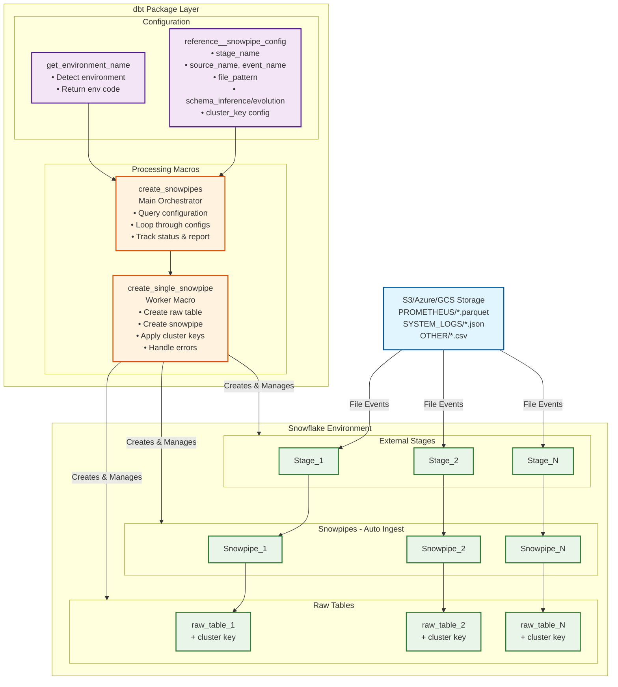

# dbt-snowpipe-utils

Automated Snowflake Snowpipe management with schema inference and evolution support.


## Architecture


## Quick Setup

### 1. Install Package
```yaml
# packages.yml
packages:
  - git: "https://github.com/entechlog/dbt-snowpipe-utils"
    revision: main
```

```bash
dbt deps
```

### 2. Set the Variables
#### Using Environment Variables
```bash
# Required
export SNOWPIPE_DATABASE="RAW_DB"
export SNOWPIPE_SCHEMA="UTIL"
export SNOWPIPE_WAREHOUSE="COMPUTE_WH"
export SNOWPIPE_ADMIN_ROLE="SYSADMIN"
export SNOWPIPE_MONITOR_ROLES="DBT_ROLE,DATA_ENGINEER"
export ENV_CODE="dev"

# Optional
export SNOWPIPE_SEED_SCHEMA="CONFIG"
export SNOWPIPE_ERROR_INTEGRATION="ERROR_NOTIFICATION"
export SNOWPIPE_JSON_STAGE="JSON_STAGE"
export SNOWPIPE_PARQUET_STAGE="PARQUET_STAGE"
export SNOWPIPE_CSV_STAGE="CSV_STAGE"
```

#### Using dbt Variables

```bash
vars:
  dbt_snowpipe_utils:
    snowpipe_database: 
    snowpipe_schema: UTIL
    snowpipe_warehouse: 
    snowpipe_admin_role: 
    snowpipe_monitor_roles: 
    env_code: 
    snowpipe_seed_schema: 
    snowpipe_error_integration:
    snowpipe_parquet_stage:
```

### 3. Configure Pipes
Edit `seeds/reference__snowpipe_config.csv`:
```csv
stage_name,source_name,event_name,event_type,cluster_key_transformation,cluster_key_type,cluster_key,file_pattern,enable_schema_inference,enable_schema_evolution,dev_enable_pipe_flag,dev_pause_pipe_flag,stg_enable_pipe_flag,stg_pause_pipe_flag,prd_enable_pipe_flag,prd_pause_pipe_flag,notes
PARQUET_STAGE,TEST,SAMPLE_DATA,,DATE(timestamp),DATE,event_date,json,FALSE,FALSE,TRUE,TRUE,FALSE,FALSE,FALSE,FALSE,Test VARIANT mode
PARQUET_STAGE,TEST,SAMPLE_DATA_V2,,DATE(timestamp),DATE,event_date,json,TRUE,FALSE,TRUE,FALSE,FALSE,FALSE,FALSE,FALSE,Test individual columns
PARQUET_STAGE,TEST,SAMPLE_DATA_V3,,DATE(timestamp),DATE,event_date,json,TRUE,TRUE,TRUE,FALSE,FALSE,FALSE,FALSE,FALSE,Test with schema evolution
```

Load config:
```bash
dbt seed
```

## Usage

### Test Run (Dry Run)
```bash
dbt run-operation create_snowpipes --args '{"run_queries": false}'
```

### Execute
```bash
dbt run-operation create_snowpipes --args '{"run_queries": true}'
```

### Debug Mode
```bash
dbt run-operation create_snowpipes --args '{"run_queries": false, "debug_mode": true}'
```

## Storage Modes

The package automatically determines storage mode based on schema flags:

**VARIANT Mode** (`enable_schema_inference: FALSE, enable_schema_evolution: FALSE`)
- Single `DATA VARIANT` column
- All data stored in JSON format
- Best for flexible, unstructured data
- No schema management required

**Individual Columns Mode** (`enable_schema_inference: TRUE` or `enable_schema_evolution: TRUE`)
- Separate typed columns (user_id, timestamp, etc.)
- Automatic schema inference via `INFER_SCHEMA()`
- Optional automatic schema evolution
- Better query performance and compression

## Schema Management

### Schema Inference (`enable_schema_inference: TRUE`)
- Uses Snowflake's `INFER_SCHEMA()` for new tables
- Automatically detects column names and types from source files
- Creates properly typed columns instead of VARIANT

### Schema Evolution (`enable_schema_evolution: TRUE`)
- Requires `enable_schema_inference: TRUE`
- Sets `ENABLE_SCHEMA_EVOLUTION = TRUE` on tables
- Automatically adds new columns when they appear in source data
- No manual intervention required for schema changes

## File Format Support

- **JSON**: Full schema inference and evolution support
- **Parquet**: Full schema inference and evolution support  
- **CSV**: Full schema inference and evolution support

All formats use Snowflake's native `INFER_SCHEMA()` functionality.

## Configuration Reference

| Field | Required | Description | Example |
|-------|----------|-------------|---------|
| `stage_name` | No | Custom stage (uses defaults if empty) | `CUSTOM_STAGE` |
| `source_name` | Yes | Schema name for tables/pipes | `PROMETHEUS` |
| `event_name` | Yes | Table/pipe base name | `SYSTEM_METRICS` |
| `event_type` | No | Additional name suffix | `CPU` |
| `cluster_key_transformation` | No | SQL expression for clustering | `DATE(timestamp)` |
| `cluster_key_type` | No | Data type for cluster key | `DATE` |
| `cluster_key` | No | Cluster column name | `event_date` |
| `file_pattern` | Yes | File type | `json`, `parquet`, `csv` |
| `enable_schema_inference` | No | Use INFER_SCHEMA for new tables | `TRUE`/`FALSE` |
| `enable_schema_evolution` | No | Enable automatic schema evolution | `TRUE`/`FALSE` |
| `{env}_enable_pipe_flag` | No | Enable in environment | `TRUE`/`FALSE` |
| `{env}_pause_pipe_flag` | No | Pause after creation | `TRUE`/`FALSE` |

## Validation

```sql
-- Check created pipes
SHOW PIPES IN SCHEMA RAW_DB.TEST;

-- Check tables
SHOW TABLES IN SCHEMA RAW_DB.TEST;

-- View table structure
DESCRIBE TABLE RAW_DB.TEST.SAMPLE_DATA;      -- VARIANT mode
DESCRIBE TABLE RAW_DB.TEST.SAMPLE_DATA_V2;   -- Individual columns

-- Check pipe status
SELECT SYSTEM$PIPE_STATUS('RAW_DB.TEST.SAMPLE_DATA_PIPE');

-- Verify schema evolution setting
SELECT TABLE_NAME, ENABLE_SCHEMA_EVOLUTION 
FROM INFORMATION_SCHEMA.TABLES 
WHERE TABLE_SCHEMA = 'TEST' AND TABLE_NAME = 'SAMPLE_DATA_V3';
```

## Troubleshooting

**Permission Error:**
```sql
SELECT CURRENT_ROLE();
SHOW GRANTS TO ROLE YOUR_ADMIN_ROLE;
```

**Stage Not Found:**
```sql
SHOW STAGES IN SCHEMA RAW_DB.UTIL;
LIST @RAW_DB.UTIL.YOUR_STAGE/source=test/event_name=sample_data/;
```

**Schema Inference Fails:**
```sql
SELECT * FROM TABLE(INFER_SCHEMA(
    LOCATION => '@YOUR_STAGE/path/', 
    FILE_FORMAT => 'JSON_FORMAT'
));
```

**Debug Variables:**
```bash
dbt run-operation debug_variables
```

## Environment Variables

| Variable | Default | Description |
|----------|---------|-------------|
| `SNOWPIPE_DATABASE` | `RAW_DB` | Target database |
| `SNOWPIPE_SCHEMA` | `UTIL` | Stages/formats schema |
| `SNOWPIPE_WAREHOUSE` | `COMPUTE_WH` | Warehouse for operations |
| `SNOWPIPE_ADMIN_ROLE` | `SYSADMIN` | Role for pipe creation |
| `SNOWPIPE_MONITOR_ROLES` | `SYSADMIN` | Comma-separated monitor roles |
| `ENV_CODE` | `dev` | Environment (dev/stg/prd) |

## Best Practices

1. **Start with schema inference** for new data sources
2. **Enable schema evolution** only when you expect schema changes
3. **Use clustering keys** for time-series data (e.g., `DATE(timestamp)`)
4. **Test in dev** with `run_queries: false` first
5. **Monitor pipe status** after creation
6. **Use VARIANT mode** for highly dynamic schemas